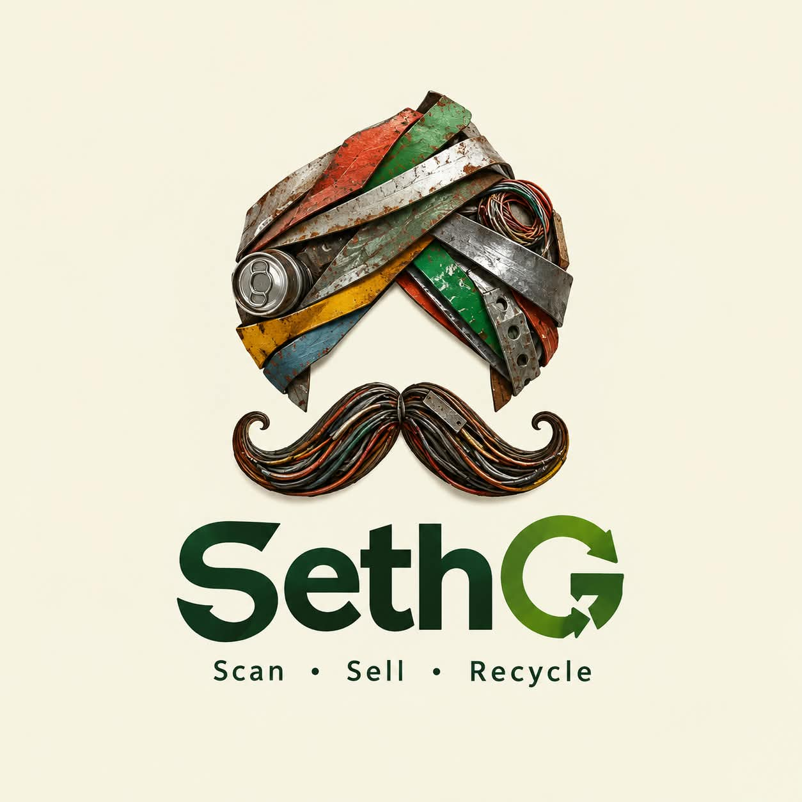

<p align="center">
  
</p>

<h1 align="center">Seth G (सेठ जी)</h1>

<p align="center">
  <strong>Scan • Sell • Recycle</strong><br>
  A digital cooperative marketplace that connects informal waste collectors (kabadiwalas) directly to certified industrial recyclers.
</p>

---

## 🛑 The Problem

* **Trapped by Middlemen**: Small collectors pick only 10–20 kg of scrap per day. Big factories only buy in tons (500+ kg). Because collectors cannot sell in bulk alone, middlemen buy their scrap at unfair, throwaway prices.
* **Low Earnings**: Collectors do not know real daily market rates and lose out when scrap metal prices surge.
* **Wasted Resources & Toxic Burning**: When informal workers burn cables or use crude acid to extract metals, over **70% of precious copper, gold, and silver is lost forever** into toxic smoke and ash.
* **Zero Verification**: Informal scrap has no digital receipt or origin proof, so formal recyclers cannot use it to meet government **CPCB / EPR** recycling targets.

---

## 💡 The Solution

* **Cooperative Scrap Pooling**: Small collectors join hands to combine their scrap into large shared "Pools" under a pool admin. Pooling unlocks wholesale volume and cuts out middlemen completely.
* **Direct Bidding Marketplace**: Certified recyclers bid directly on pooled scrap lots. Collectors earn **30% to 50% more profit**.
* **Live Price Surge Alerts**: Instant market notifications alert collectors when scrap prices rise (e.g. PCB board price spikes), ensuring fair pay.
* **On-Device AI Scanner**: Works **100% offline** on low-cost phones to instantly detect genuine e-waste and predict fair ₹/kg market rates.
* **Blockchain Trust & EPR**: Every handover creates a tamper-proof cryptographic proof and digital EPR certificate on the Polygon blockchain for government compliance.

---

## 🛠️ Technologies Used

| Area | Technology | Simple Purpose |
| :--- | :--- | :--- |
| **Mobile App** | **Android (Kotlin & Jetpack Compose)** | Clean, multi-language UI (Hindi, English, Marathi, Telugu) designed for low-literacy users. |
| **Offline Cache** | **Room Database** | Lets collectors record lots and view earnings even with zero internet. |
| **Edge AI / ML** | **TensorFlow Lite & Google ML Kit** | On-device e-waste image detection and price prediction without needing cloud servers. |
| **Backend API** | **Node.js & Express** | Lightweight, high-speed REST API handling matching, chats, and notifications. |
| **Database** | **PostgreSQL** | Reliable database for user accounts, marketplace bids, pools, and trip logs. |
| **Blockchain** | **Polygon & Ethers.js** | Transparent smart escrow payments and tamper-proof CPCB EPR recycling certificates. |

---

## 🚀 Quick Run

### Backend
```bash
cd backend
npm install
npm run migrate
npm run dev
```

### Android App
```bash
cd android
./gradlew installDebug
```
